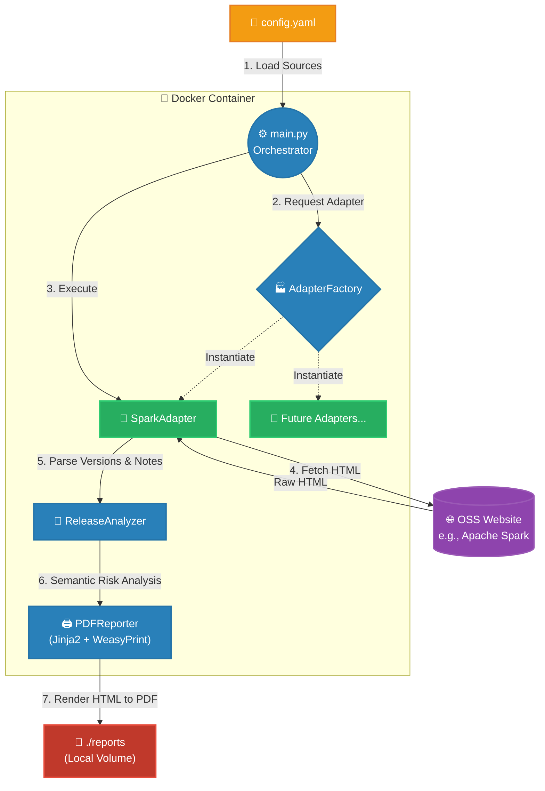

# OpenSource Release Tracker & Synthesizer

An automated system that tracks the latest release notes of specific Big Data open-source projects, synthesizes them using the Google Gemini API, and generates concise Markdown reports.

## System Workflow



## Project Directory Structure

```text
oss_release_analyzer/
├── config.yaml               # File cấu hình danh sách các project cần phân tích
├── docker-compose.yml        # Cấu hình Docker Compose
├── Dockerfile                # Định nghĩa image (Python 3.10 + OS deps)
├── requirements.txt          # Python dependencies
├── main.py                   # Entry point / Orchestrator
├── reports/                  # Thư mục chứa file PDF đầu ra (được map volume)
└── src/
    ├── __init__.py
    ├── crawler/              # Module cào và bóc tách dữ liệu
    │   ├── base_adapter.py   # Abstract Base Class (Interface)
    │   ├── spark_adapter.py  # Logic cào dữ liệu riêng cho Apache Spark
    │   └── factory.py        # Factory pattern để khởi tạo Adapter
    ├── analyzer/             # Module phân tích rủi ro và thay đổi
    │   └── release_analyzer.py
    └── reporter/             # Module render PDF
        └── pdf_generator.py
```

## ✨ Tính năng cốt lõi
1. Dynamic Configuration: Hỗ trợ cào dữ liệu từ nhiều nguồn khác nhau thông qua file config.yaml.
2. Extensible Crawler (Adapter Pattern): Dễ dàng cắm thêm (plug-in) các logic cào dữ liệu cho các trang web có cấu trúc HTML khác nhau mà không làm ảnh hưởng đến core logic.
3. Semantic Versioning Logic: Tự động nhận diện phiên bản mới nhất (Latest) và phiên bản trước đó (Previous) dựa trên chuẩn SemVer.
4. Automated Risk Analysis: Đánh giá rủi ro nâng cấp (High/Medium/Low) dựa trên sự thay đổi của Major/Minor/Patch versions.
5. PDF Generation: Tạo báo cáo PDF chuyên nghiệp với WeasyPrint và Jinja2.
6. 100% Dockerized: Không yêu cầu cài đặt dependencies phức tạp (như thư viện C của WeasyPrint) trên máy host.

## 🚀 Hướng dẫn cài đặt và sử dụng
Yêu cầu hệ thống
- Docker
- Docker Compose
### Chạy hệ thống
Bạn không cần cài đặt Python hay bất kỳ thư viện nào trên máy thật. Chỉ cần chạy lệnh sau tại thư mục gốc của dự án:
code
``` Bash
docker compose up --build
```
**Kết quả:** 
Hệ thống sẽ tự động tải HTML, phân tích và xuất file PDF báo cáo vào thư mục ./reports/ trên máy của bạn.
### ⚙️ Cấu hình (config.yaml)
Để thêm các dự án cần phân tích, bạn chỉ cần khai báo vào file config.yaml:
code
``` Yaml
sources:
  - name: apache_spark
    url: https://spark.apache.org/releases/
  # Thêm các nguồn khác tại đây trong tương lai
  # - name: apache_kafka
  #   url: https://kafka.apache.org/downloads
```

### 🛠 Hướng dẫn mở rộng (Thêm một nguồn dữ liệu mới)
Hệ thống tuân thủ nguyên lý Open/Closed Principle. Để hỗ trợ một trang web mới (ví dụ: Apache Kafka), bạn thực hiện 3 bước sau:
1. **Tạo Adapter mới:**
Tạo file src/crawler/kafka_adapter.py kế thừa từ BaseAdapter.
``` Python
from src.crawler.base_adapter import BaseAdapter

class KafkaAdapter(BaseAdapter):
    def parse_versions(self, html: str) -> tuple[str, str]:
        # Viết logic bóc tách version cho Kafka tại đây
        pass

    def extract_notes(self, html: str, latest_version: str) -> dict[str, list[str]]:
        # Viết logic bóc tách release notes cho Kafka tại đây
        pass
```
2. **Đăng ký Adapter vào Factory:**
Mở file src/crawler/factory.py và thêm Adapter mới vào dictionary:
``` Python
from src.crawler.kafka_adapter import KafkaAdapter

class AdapterFactory:
    @staticmethod
    def get_adapter(name: str, url: str) -> BaseAdapter:
        adapters = {
            'apache_spark': SparkAdapter,
            'apache_kafka': KafkaAdapter  # <-- Thêm dòng này
        }
        # ...
```
3. **Cập nhật config.yaml:** Thêm apache_kafka vào danh sách sources. Chạy lại Docker và hệ thống sẽ tự động xử lý